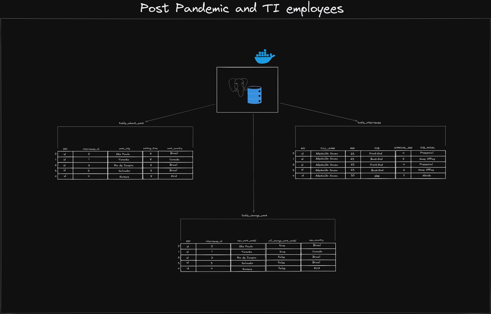

<h1 align="center">The post-pandemic and the work model of IT professionals</h1>

<strong>THIS DB HAS NO TRUE DATA, THEY ARE ONLY FICTIONAL FOR
STUDY.</strong>

  

Modeling made in [Excalidraw](https://excalidraw.com/)
`modeling available` [aqui](./.github/img/excalidraw-of-project.png).

Database created and developed using PostgreSQL, PGAdmin and Docker.

## 📦 Dependências para rodar a aplicação

- `Docker.`
- `Excalidraw, to view the diagram.`

## 📜 Sobre o banco

The theme given to our team was the model of work in the post pandemic
of covid. As a choice of database, we had PostgreSQL + pgAdmin 4. A
docker image was created to generate the database and its
dependencies, aiming at fairness in the environment among all the
team.

### 🪄 Storage Procedure and Views

In addition, Storage Procedures and Views were created to assist in
the search for data in the database.

- Storage Procedures:
  - Respondents who think about changing their work model.
  - Respondents working on more than one model.
- Views:
  -  Views to map the most searched countries.
  -  Views to map work time x experience.

### 👨🏾‍🔬 Modelagem inicial do banco

 ## Adicionar no futuro

### 📊 Diagrama do Banco

## 📌 Links úteis

- Slide da apresentação
  [aqui](assets/slide/Banco%20de%20Dados%20-%20Covid%20UNIME.pptx)
- [Brasil.io](https://brasil.io/dataset/covid19/caso/) usado como base
  para a modelagem.

## 👨🏾‍🦱 Equipe composta por

- Lucas Souza.
- Bruno Lucciola.
- Davi Miranda
- Gabriel Melo

---

Develop with 💜 by - Lucas Souza(@deverebor)

