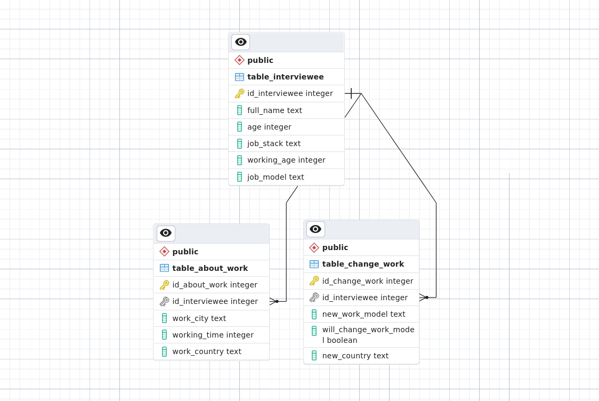

# The post-pandemic and the work model of IT professionals

**THIS DB HAS NO TRUE DATA, THEY ARE ONLY FICTIONAL FOR STUDY.**


Modeling made in [Excalidraw](https://excalidraw.com/)
`modeling available` [here](./.github/img/excalidraw-of-project.png).

> Database created and developed using PostgreSQL, PGAdmin and Docker.

## 📦 Dependencies to run the project

- `Docker version 20.10 or better`

## 🎲 Running the project

```zsh
# Clone this repository
git clone git@github.com:deverebor/postgresql-univercity-database-project.git
```

```zsh
# Access the project folder in the / cmd terminal
cd postgresql-univercity-database-project
```

```zsh
# Please have docker installed on your machine
docker compose up
```

```zsh
# access the pgadmin on https://localhost:5050
```

## 🛠️ How to populate the database

Make sure you are running the project and have the pgadmin open.

```zsh
# Access the pgadmin on https://localhost:5050
```

```zsh
# Create a new db using the script dump.sql
# And then copy and past the populate sql script in utils folder
```

## 📜 About project

The theme given to our team was the model of work in the post pandemic
of covid. As a choice of database, we had PostgreSQL + pgAdmin 4. A
docker image was created to generate the database and its
dependencies, aiming at fairness in the environment among all the
team.

## 🪄 Storage Procedure and Views

In addition, Storage Procedures and Views were created to assist in
the search for data in the database.

- Storage Procedures:
  - Respondents who think about changing their work model.
  - Respondents working on more than one model.
- Views:
  - Views to map the most searched countries.
  - Views to map work time x experience.

---

## 🚀 System project

The project was created with the aim of showing the impact of the
pandemic on the life of the IT professional.

To develop this project it was necessary to divide it into 4 parts.

- Which tool to use?
- What type of bank to use (relational or not)?
- How to be sure that all people can have the same work environment?
- How to generate graphs of this data?

And for each of these questions an answer was found.

### 👨🏾‍🔬 Answering these doubts

> Which tool to use?

The tool we decided to work with was PostgreSQL.

Today pgSQL is one of the most used databases in the world. An open
source tool that takes with it several collaborators who are daily
looking to improve the software.

> What type of bank to use (relational or not)?

So we decided to go to the relational database. That way we would be
able to have more control over our tables. Since in a non-relational
database (Mongo for example) collections are used.

> How to be sure that all people can have the same work environment?

To solve this problem we decided to use Docker. With it we were able
to create an image that would have all the dependencies necessary for
the project to run.

This way we could be sure that everyone would have the same
environment.

> How to generate graphs of this data?

This step was the most difficult. We had to find a way to generate
graphs from the data in the database. And we found a way to do it
using pgAdmin 4.

pgAdmin 4 is a tool that allows you to manage PostgreSQL databases. It
is a graphical interface that allows you to create, edit and delete
tables, views, procedures, etc. This tool has an function that allows
you to generate graphs from the data in the database.

But we had find other way to generate graphs. So we decided to use
Python. With it we were able to generate graphs from the data in the
database.

### 🔨 Turning the idea into reality

To turn the idea into reality we had to follow some steps. The first
step was create the base project with Excalidraw, this way we could
have a better visualization of the project and see where we would have
to make changes.


After that the second step was to create the database. To do this we
used the pgAdmin 4 tool. With it we were able to create the database
and its tables. We also created the procedures and views.

> 📊 EDR (Entity Relationship Diagram) about the database



The third step was to create the docker image. With it we were able to
create the database and its dependencies. This way we could be sure
that everyone would have the same environment and would not have any
problems when running the project.

The fourth step was to create the graphs. With pgAdmin 4 we were able
to generate graphs from the data in the database. But we also had to
create other graphs. So we decided to use Python. With it we were able
to generate graphs from the data in the database.

## 📌 Useful's links

- Presentation pptx
  [here](assets/presentation/ANHANGUERA_SYSTEM_PROJECT.pptx)
- [Brasil.io](https://brasil.io/dataset/covid19/caso/) use as base to
  create relationships and structure.

## 👨🏾‍🦱 The team

- [Lucas Souza](https://www.linkedin.com/in/lucas-souza-dev/).
- [Bruno Lucciola](https://www.linkedin.com/in/brunolucciola/).
- [Davi Miranda](https://www.linkedin.com/in/davi-miranda/).
- [Gabriel Melo](https://github.com/ArkGM).

---

Develop with 💜 by - Lucas Souza(@deverebor)
